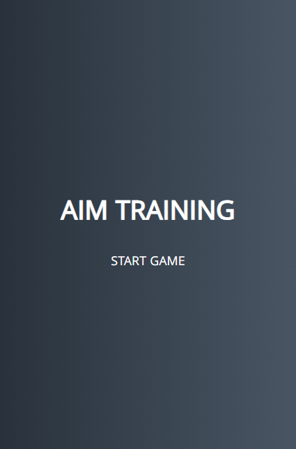
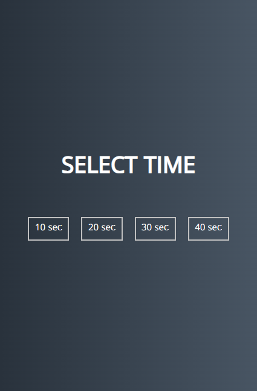
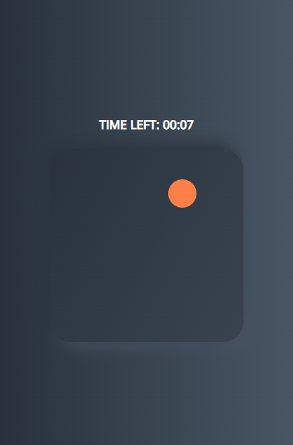
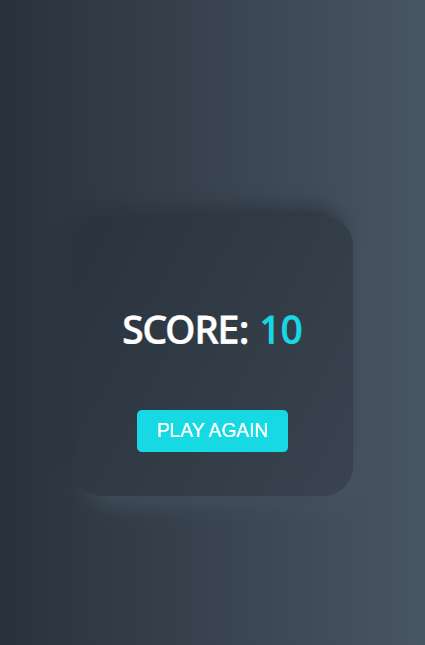

# Aim Training Game

**Aim Training Game** — это проект для тренировки вашей реакции и точности. Игрок выбирает длительность игры, после чего появляются случайные цели, которые необходимо быстро нажимать. По завершении времени отображается результат и кнопка для начала новой игры.

## Особенности

- Возможность выбора времени игры (10, 20, 30 или 40 секунд).
- Появление случайных целей разных размеров и цветов.
- Звуковой эффект при попадании в цель.
- Подсчет очков, отображение результата и возможность начать новую игру.
- Стильный, минималистичный интерфейс с адаптивным дизайном.

## Технологии, используемые в проекте

- **HTML5**: базовая разметка страниц.
- **CSS3**: стилизация элементов, использование flexbox для выравнивания.
- **JavaScript (Vanilla)**: логика игры, обработка событий, динамическое создание элементов на странице.

## Структура проекта

- **index.html**: содержит разметку страницы и основные элементы.
- **styles.css**: стили для оформления всех элементов игры.
- **app.js**: скрипт с логикой игры, включая генерацию целей, подсчет времени и обработку событий.

## Как запустить проект

1. Скачайте или клонируйте репозиторий.
2. Откройте файл `index.html` в любом современном браузере.
3. Нажмите на кнопку "START GAME" и выберите время игры.

## Скриншоты

  
   
   
   

